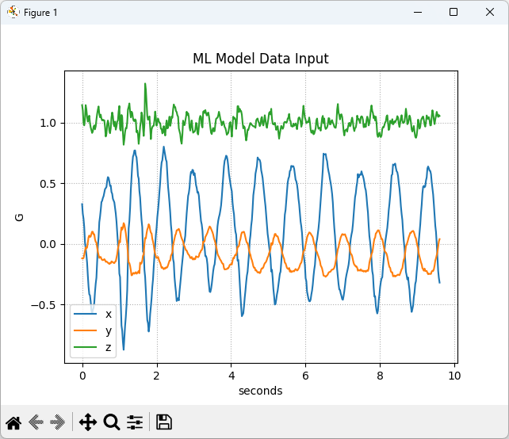
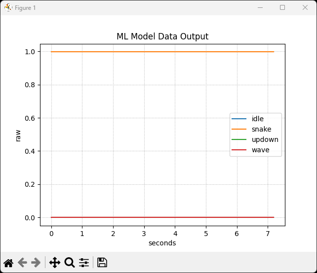

# SDS Recordings with B-U585I-IOT02A Board

## Overview
This folder contains SDS recordings captured with the **B-U585I-IOT02A** board.  
The recordings include accelerometer data as well as machine learning (ML) inference results.
Metadata files describe the format and usage of these recordings.

## File description
- **DataInput.n.sds** – streams of accelerometer data used as input for ML.  
- **DataOutput.n.sds** – streams of ML inference results.  
- **DataInput.sds.yml** – metadata description for all `DataInput.n.sds` files.  
- **DataOutput.sds.yml** – metadata description for all `DataOutput.n.sds` files.  

### Available Recordings
Each file contains **10 seconds** of data:

- **Idle State**  
  - Input: `DataInput.0.sds`, `DataInput.1.sds`, `DataInput.2.sds`  
  - Output: `DataOutput.0.sds`, `DataOutput.1.sds`, `DataOutput.2.sds`  

- **Snake Movement**  
  - Input: `DataInput.3.sds`, `DataInput.4.sds`, `DataInput.5.sds`  
  - Output: `DataOutput.3.sds`, `DataOutput.4.sds`, `DataOutput.5.sds`  

- **Up/Down Movement**  
  - Input: `DataInput.6.sds`, `DataInput.7.sds`, `DataInput.8.sds`  
  - Output: `DataOutput.6.sds`, `DataOutput.7.sds`, `DataOutput.8.sds`  

- **Wave Movement**  
  - Input: `DataInput.9.sds`, `DataInput.10.sds`, `DataInput.11.sds`  
  - Output: `DataOutput.9.sds`, `DataOutput.10.sds`, `DataOutput.11.sds`  

## Visualization
You can graphically represent SDS files using the **SDS-View** utility.

1. Copy the `sds-view.py` file from the SDS installation (`/utilities` sub-folder) into this folder.  
2. Run the following command to visualize an input recording:

   ```bash
   python sds-view.py -y DataInput.sds.yml -s DataInput.3.sds
   ```
   Example visualization:

   

3. To visualize an output recording:

   ```bash
   python sds-view.py -y DataOutput.sds.yml -s DataOutput.3.sds
   ```
   Example visualization:

   
